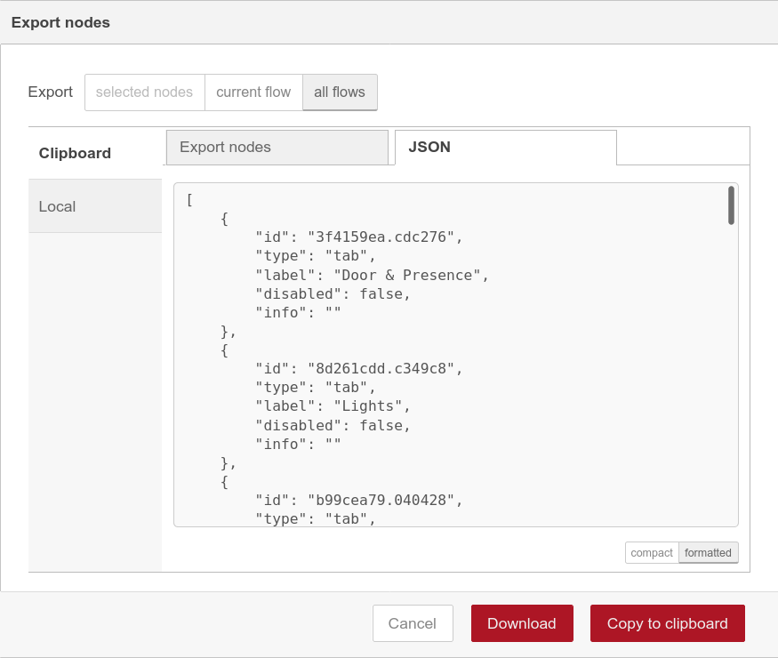

# Основные действия с системой автоматизации
В этом документе описываются инструкции по основным взаимодействиям с системой автоматизации (СКУДом).

-----

## Как получить доступ к Node-RED
Доступ к интерфейсу управления Node-RED закрыт снаружи. Для подключения к веб-интерфейсу, необходимо
установить SSH-туннель до Corleone (Raspberry Pi 3B+ в серверной, отвечающая за систему автоматизации):

```bash
ssh -L 1880:127.0.0.1:1880 pi@local.0x08.in
```

Далее, откройте в браузере [http://localhost:1880](http://localhost:1880) и аутентифицируйтесь, 
используя данные для доступа из кейчейна KeepassXC.

-----

## Как добавить новый пропуск?
Залогиньтесь на Corleone:

```bash
# Из внутренней сети Бэкспейса
ssh pi@10.0.2.2

# Из внешней сети
ssh -J pi@local.0x08.in:2022 pi@10.0.2.2
```

Выполните в терминале команду `mqtt-monitor | grep 'rfid'` и приложите
карточку, которую вы хотите зарегистрировать как пропуск. 

В терминале появятся списки UID-ов всех просканированных карт.
Игнорируйте "нулевой" UID (0000000000000000000000000000000000000000), так как он служит для обозначения состояния "нет карты".

```bash
$ mqtt-monitor | grep 'rfid'
modbus/rfid/state/uid 000800F90049005F000000000000000000000000 # настоящая карта
modbus/rfid/state/uid 0000000000000000000000000000000000000000 # состояние "нет карты"
```

Скопируйте полный UID нужной карты (40 HEX-символов). Начните новую сессию от пользователя "acs" и откройте
для редактирования файл `/home/acs/app/config/ids.txt.automation`:

```bash
# Начинаем сессию от пользователя acs
$ sudo su - acs

# Открываем файл на редактирование
$ nano /home/acs/app/config/ids.txt.automation
```

Пролистайте файл до конца и перейдите на строку, следующую за последней записью. 
Вставьте скопированный UID, и через запятую допишите человекочитаемый идентификатор этой карты:
```
.... 
00AA00BB00CC00DD000000000000000000000000,johndoe          <-- последняя запись
000800F90049005F000000000000000000000000,my_new_member    <-- наша новая карта
```

Сохраните файл. Сценарий в Node-RED автоматически загрузит и применит изменения из файла. 
Подойдите к считывателю с привязанной картой и проверьте всё ли правильно работает. 
Если нет — попробуйте перезагрузить службу Node-RED: `sudo systemctl restart nodered.service`

Закоммитьте изменения в файле со списком пропусков:

```bash
# Переходим в директорию с acs-secrets
cd /home/acs/app/config

# Стэйджим изменения
git add -A

# Коммитим
git commit -m "Added Vasya's card"

# Пушим
git push
```

-----

## Как открыть дверь вручную, в обход сценариев автоматизации
Залогиньтесь на Corleone:

```bash
ssh pi@local.0x08.in
```

Выполните команду `open-door` для открытия входной и аквариумной двери, или `open-aquarium` для
открытия только аквариумной двери. 

Обратите внимание на то, что открытая входная дверь **не может быть закрыта удалённо, для этого придётся ехать и закрывать её вручную.**

-----

## Как сохранить изменения в сценариях автоматизации?
Если вы внесли какие-то изменения в сценарии автоматизации, которые хотите сохранить, то вам нужно:

  1. Экспортировать изменённый граф. Для этого, в интерфейсе Node-RED нажмите на иконку меню (в правом верхнем углу),
     выберите пункт "Export".

  2. В появившемся модальном окне, выберите режим экспорта **"all flows"**, форматирование — **"formatted"**. 
  Опция форматирования спрятана внизу вкладки JSON:
  

  3. Нажмите на кнопку "Download" и сохраните файл flows.json.

  4. Переместите сохранённый файл в этот репозиторий как `software/nodered/flowgraphs/main.json`

  5. Закоммитьте новый `main.json`, описав внесённые изменения в multiline commit message. В первой строке должно быть краткое описание 
     изменений (например, "Добавлено включение вентиляции по датчику CO2"), в последующих — подробное описание 
     изменений и затронутых flows (например, "Добавлен Flow "Ventilation automation" с обработкой данных от датчика.
     Добавлен subflow "Activate ventillation" реализующий логику открытия/закрытия вентиляции).

  6. Не забудьте запушить закомиченные изменения.
